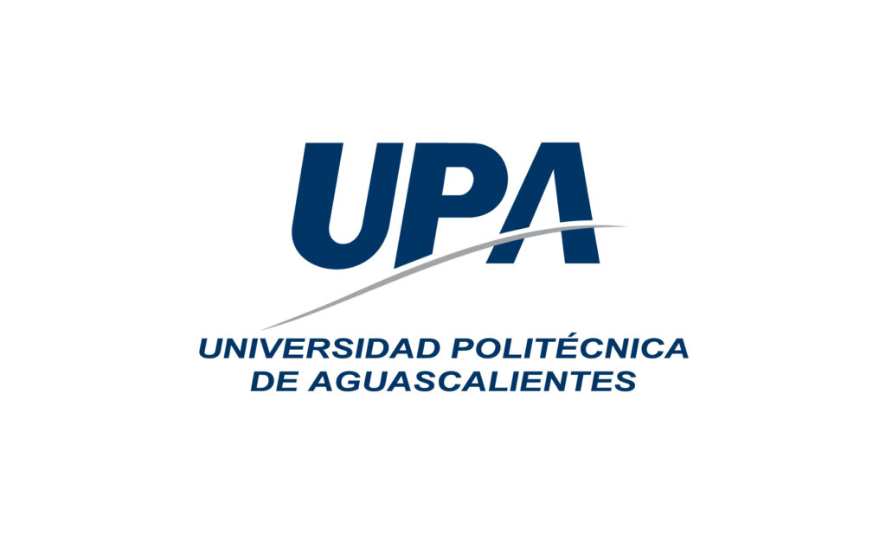

# UP210908_CPP
## **REPOSITORIO DE PROGRAMACION**
### _Miguel Angel Ortiz_

El curso tiene contenidos de programacion orientados al lenguaje c++ y constara de 4 unidades que se podran visualizar despues del gallo

## UNIDADES Y SUS CONTENIDOS
<ol>
<li><a href="https://github.com/UP210908/UP210908_CPP/tree/main/U1">UNIDAD 1: Introduccion a la programacion</a>
<li><a href="https://github.com/UP210908/UP210908_CPP/tree/main/U2">UNIDAD 2: Estructuras y ciclos de control</a>
<li><a href="https://github.com/UP210908/UP210908_CPP/tree/main/U3">UNIDAD 3: Funciones</a>
<li><a href="https://github.com/UP210908/UP210908_CPP/tree/main/U1">UNIDAD 4: Archivos y arreglos</a>
</ol>
  
Las carpetas tendran un **_README.md_** el cual describira cada unidad y los archivos realizados en cumplimiento a los objetivos

### TABLA DE PONDERACION DE UNIDADES

<table class= "default" align="center">
<tr>
  <th>UNIDADES</th>
  <th>TAREAS</th>
  <th>TRABAJOS</th>
  <th>EXAMEN</th>
 </tr>
 <tr>
  <td>Unidad 1</td>
  <td align="center">--</td>
  <td align="center">--</td>
  <td align="center">--</td>
 </tr>
  <tr>
  <td>Unidad 2</td>
  <td align="center">--</td>
  <td align="center">--</td>
  <td align="center">--</td>
 </tr>
<tr>
  <td>Unidad 3</td>
  <td align="center">--</td>
  <td align="center">--</td>
  <td align="center">--</td>
 </tr>
 <tr>
  <td>Unidad 4</td>
  <td align="center">--</td>
  <td align="center">--</td>
  <td align="center">--</td>
 </tr>
 </table>
 
