# Exercise 1- Program that shows the user the corresponding tax rate based on their annual rent
## Section for tax selection (c++ code).
### Input
```c++
    //-----------Instanced Libraries--------------
    #include <iostream>
    using namespace std;

    int main(){

    //------------Declaration of variables---------
        int renta, descuento, num;
        cout<<"Ingrese la cantidad de renta mensual: ";
        cin>>renta;
```
### Process
```c++
    //-----------Conditionals and printing of results----------

    
        if(renta<10000){
    //------------Desc calculation operation-------
            descuento= (renta/100)*5;
            num=5;
            
        }

        if(renta>=10000 && renta<20000){
            descuento= (renta/100)*15;
            num=15;
        }

        if(renta>=20000 && renta<35000){
            descuento= (renta/100)*20;
            num=20;
        }

        if(renta>=35000 && renta<60000){
            descuento= (renta/100)*30;
            num=30;
        }

        if(renta>=60000){
            descuento= (renta/100)*45;
            num=45;
        }
 ```
 ### Output
 ```c++
//------Printing results-----------
        cout<<"\n";
        cout<<"El descuento aplicado a tu total es del: "<<num<<"%";
        cout<<"\n";
        cout<< "El total es: $"<<descuento;
        cout<<"\n";
        
        return 0;
    }
```    
## Explanation of the code function.

1. Ask the user for his annual rent.
2. Check that the user entered a valid rent.   
2.1 If the user does not enter a valid rent, print a message that the user entered an incorrect number.  
2.2 If the user entered a valid rent, continue with the program.
3.  Check by several if's which tax rate.  
3.1 If the rent is less than $10, 000 it is 5%.  
3.2 If the rent is greater than or equal to $10,000 and less than $20,000 it is 15%.  
3.3 If the rent is greater or equal to $20,000 and less than $35,000, it is 20%.   
3.4 If the rent is greater or equal to $35,000 and less than $60,000 it is 30%.  
3.5 If the rent is greater than $60,000 it is 45%. 
4. Multiply the rent by the tax rate.
5. Print the tax rate and its equivalent in dollars. 

## Tests with all cases
<ol>
<li>Tax when: rent < $10,000
    <div align="center">
    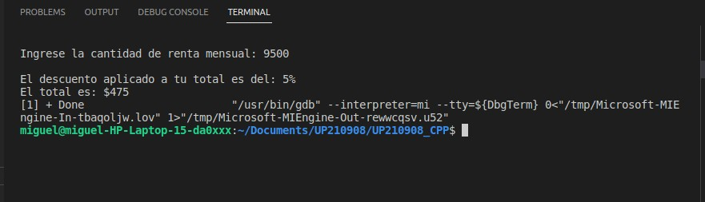
    </div>
<li>Tax when: rent >= $10,000 and < $20,000
    <div align="center">
    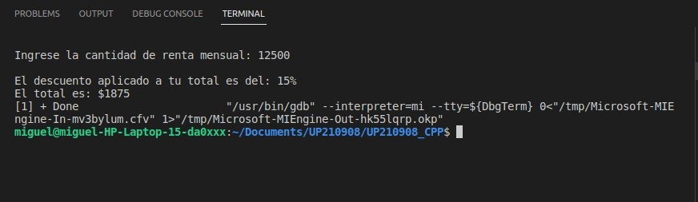
    </div>
<li>Tax when: rent >= $20,000 and < $35,000
    <div align="center">
    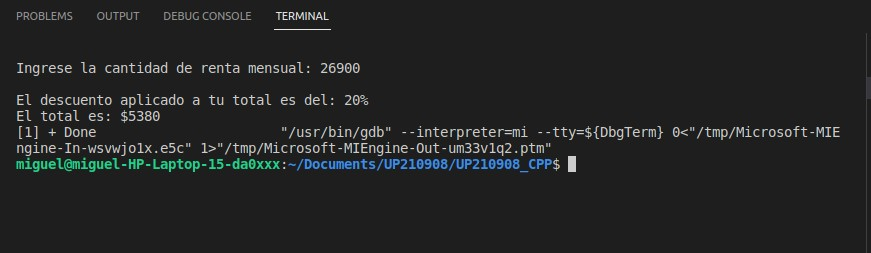
    </div>
<li>Tax when: rent >= $35,000 and < $60,000
    <div align="center">
    
    </div>
<li>Tax when: rent >= $60,000
    <div align="center">
     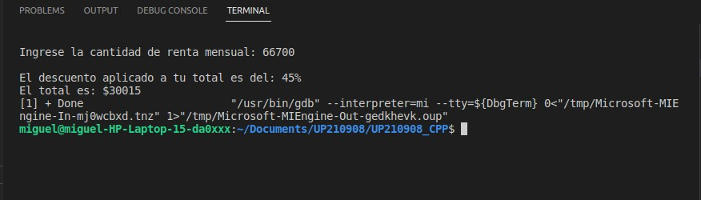
     </div>
</ol>

<br>
<br>

# Exercise 2: Benefits (Based on user score)
## Code Section (c++ code)
### Input structure
```c++
      #include <iostream>

      using namespace std;

      int main(){

            double puntuacion, total, puntuacion1, bandera=1;

            cout<<"Ingresa el procentaje de tu puntuacion: ";
            cin>>puntuacion;
```
### Process structure
```c++
      puntuacion1= puntuacion/100;
      total= puntuacion1*2400;

      if(puntuacion1==0.0){
          cout<<"Calificacion: Inaceptable";
      
      }
      else if(puntuacion1==0.4){
          cout<<"Calificacion: Aceptable";
    
      }
      else if(puntuacion1>=0.6){
          cout<<"Calificacion: Merito";
        
       
      }
      else{
          cout<<"Esta calificacion no esta aceptada por el sistema";
          cout<<"\n";
          bandera=0;
      }
```
### Output structure
```c++
      cout<<"\n";

      if(bandera==1){
          cout<<"Tu bono es igual a: $"<<total;
          cout<<"\n";
          cout<<"Con un porcentaje del: "<<puntuacion<<"%"; 
          cout<<"\n";  
      }

    
     }
```
## Explanation of the code function
The program consists of granting a bonus to employees according to their performance. Performance is considered in three scores that are 0.0, 0.4, 0.6 or more where:
<ol type="a">
<li>The 0.0 rating is unacceptable and the bonus is 0%.
<li>The score of 0.4 is acceptable and the bonus is 40%.
<li>The score of 0.6 or more is merit and the bonus is 60% or more depending on the score.
</ol>

Any amount entered other than those already mentioned will be rejected.

## Test with all cases

<ol>
<li>When the score percentage is equal to 0
    <div align="center">
    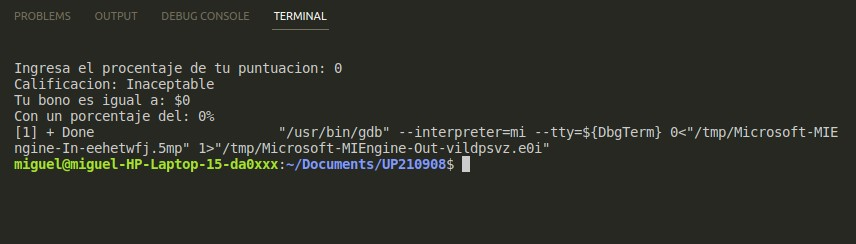
    </div>
<li>When the score percentage is equal to 40
    <div align="center">
    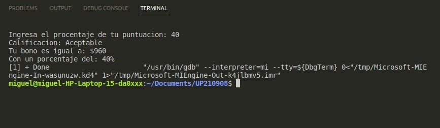
    </div>
<li>When the score percentage is equal to 60 or more
    <div align="center">
    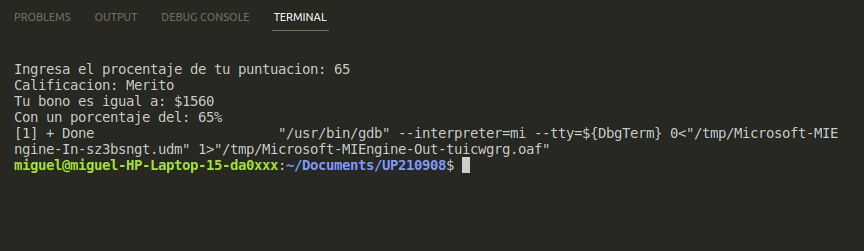
    </div>
<li>When the user enters an unaccepted value
    <div align="center">
    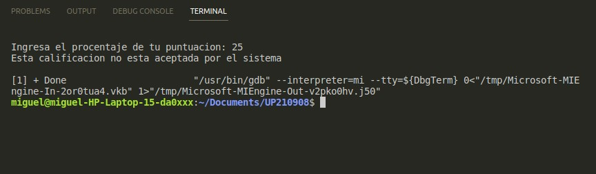
    </div>
</ol>

<br>
<br>

# Exercise 3: Price (The assigned price depends on your age.)
## Code section (c++ code)
### Input structure
```c++
      #include <iostream>

      using namespace std;

      int main(){

      //-----Variable declaration-----
      int edad, pago;

      //-----Data entry-----

      cout<<"Bienvenido a Game Zone\n";
      cout<<"Ingresa tu edad: ";
      cin>>edad;
      cout<<"\n";     
```
### Process structure
```c++
      //-----Procces-----    

      if(edad>=0 && edad<4){
          pago=0;
          cout<<"Tu entrada es gratuita"<<endl;
      }
      else if(edad>=4 && edad<=18){
          pago=5;
      }
      else if(edad>18){
          pago=10;
      }
      else{
          cout<<"El valor ingresado es erroneo"<<endl;
      }
```
### Output structure
```c++
     cout<<"Tu entrada tendra un valor de $"<<pago<<".00";
     cout<<"\n";
  }
```
## Explanation of the code function
The program works by granting the user a special price depending on their age:
<ol type= "a">
<li>The program asks the age of the user
<li>The program gives you the value of your ticket
<li>If the age of the person is less than 4, the entrance is free
<li>If the age of the person is over 4 and under 18, the ticket will have a value of $5.00 MXN
<li>If the age is greater than 18, the ticket will have a value of $10.00 MXN
</ol>
## Test with all cases

<ol>
<li>Value of the ticket when age is less than 4
    <div align="center">
    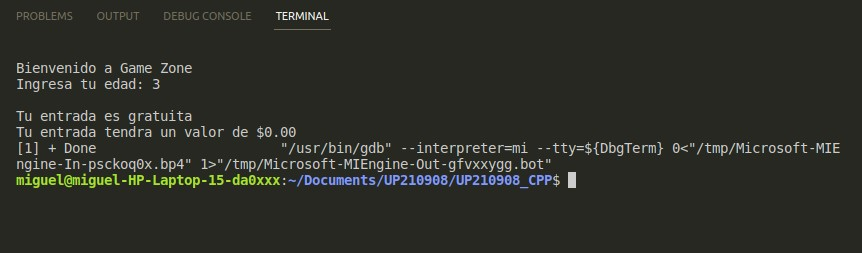
    </div>
<li>Value of the ticket when the age is greater than 4 years and less than 18
    <div align="center">
    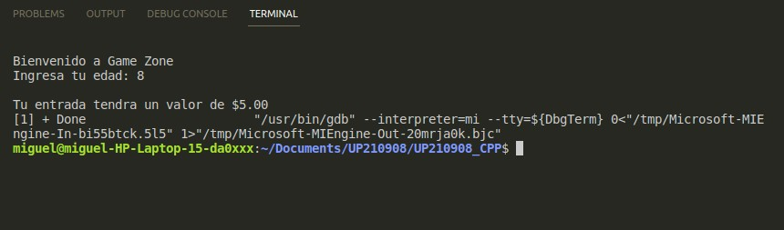
    </div>
<li>Value of the ticket when the age is over 18 years
    <div align="center">
    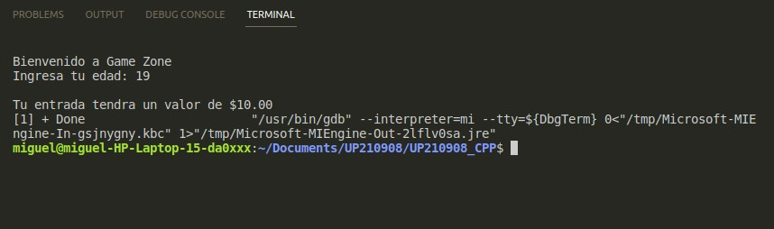
    </div>
</ol>

<br>
<br>

# Exercise 4: Pizza (Menu for customer choice)
## Code section (c++ code)
### Input structure
```c++
      #include <iostream>

      using namespace std;

      int main(){

          int opcionPizza, opcionIngrediente;
          char muestra[40];

          cout<<"Bienvenido a Pizza Hot\n";
          cout<<"Selecciona la pizza que deseas: \n Opcion | Pizza \n---------------\n  1     | Vegetariana\n  2     | No vegetariana\nOpcion: ";
          cin>>opcionPizza;     
```
### Process and output structure 
```c++
          if(opcionPizza == 1){
          cout<<"Selecciona el ingrediente de tu pizza: ";
          cout<<"\n1. Pimiento\n2. Tofu\nOpcion: ";
          cin>>opcionIngrediente;
          if(opcionIngrediente==1){
              cout<<"Tu pizza es Vegetariana con Pimiento"<<endl;
          }
          else if(opcionIngrediente==2){
              cout<<"Tu pizza es Vegetariana con Tofu"<<endl;
          }

          }
          else if(opcionPizza == 2){
              cout<<"Selecciona el ingrediente de tu pizza: ";
              cout<<"\n1. Peperoni\n2. Jamon\n3. Salmon\nOpcion: ";
              cin>>opcionIngrediente;
              if(opcionIngrediente==1){
                  cout<<"Tu pizza es no Vegetariana con Pepperoni"<<endl;
              }
          else if(opcionIngrediente==2){
              cout<<"Tu pizza es no Vegetariana con Jamon"<<endl;
          }
          else if(opcionIngrediente==3){
              cout<<"Tu pizza es no Vegetariana con Salmon"<<endl;
          }
          cout<<"\n";
          cout<<"\n";
      }


     }
```
## Explanation of the code function
The program works based on a menu that is shown to the user, who will be able to choose between the options offered to finally show him his order:
<ol type= "a">
<li>The program displays the menu that can be manipulated based on the numbered options.
<li>Depending on the previous option, another menu will be displayed with the ingredients.
<li>The program will display as a result a description of the pizza and the selected ingredients.
</ol>

## Test with all cases
For the vegetarian pizza
<ol>
<li>The selection menu is displayed.
    <div align="center">
    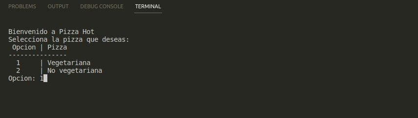
    </div>
<li>The ingredients menu is displayed immediately.
    <div align="center">
    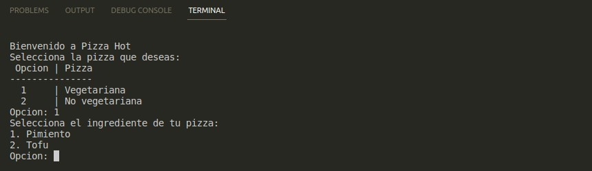
    </div>
<li>Product description as a result
    <div align="center">
    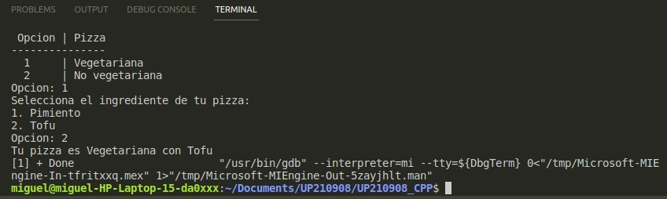
    </div>
</ol>

For the not vegetarian pizza
<ol>
<li>The selection menu is displayed.
    <div align="center">
    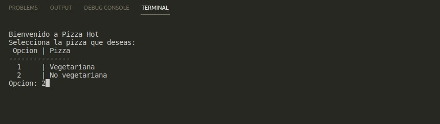
    </div>
<li>The ingredients menu is displayed immediately.
    <div align="center">
    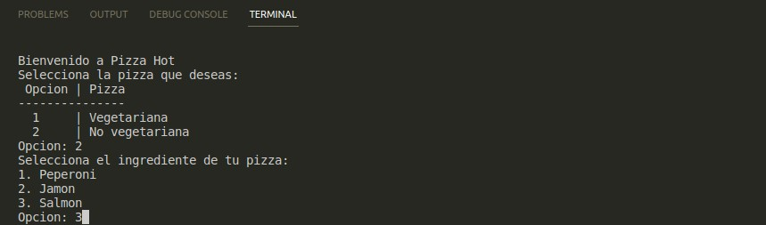
    </div>
<li>Product description as a result
    <div align="center">
    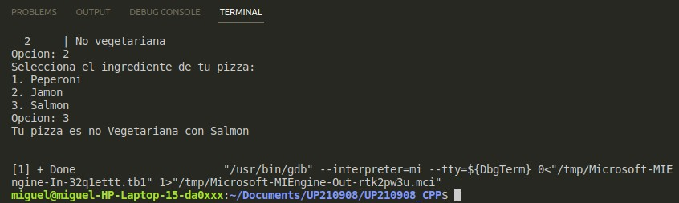
    </div>
</ol>

<br>
<br>

# Exercise 5: Maximum, minimum and average temperature, depending on what the user enters
## Code section (c++ code)
### Input structure
```c++
      #include <iostream>

      using namespace std;


      int main(){
          //----Declaracion de variables----
          float temperatura=0,promedio=0,temperaturaAcum=0, mayor, menor, comparadormax;
          int cont=1, comparadormin;

      //----inicio del ciclo----
          do{
              cont++;
              cout<<"Ingrese la temperatura:";
              cin>>temperatura;     
```
### Process structure
```c++
              temperaturaAcum+=temperatura;
              menor=temperatura;
              mayor=temperatura;
              //----Comparador del numero menor----

              if(menor<=comparadormin){
                  comparadormin=menor;
              }
              //----Comparador del numero mayor----
              if(mayor>comparadormax){
                  comparadormax=mayor;
              }

          //----Fin del ciclo----
          }while(cont<=6);
          //----Operacion del promedio----
          promedio=temperaturaAcum/6;
```
### Output structure
```c++
        //----Impresion de resultados
        cout<<"\nEl promedio es igual a:"<<promedio;
        cout<<"\nLa temperatura menor es:"<<comparadormin;
        cout<<"\nLa temperatura mayor es:"<<comparadormax;
        cout<<"\n";
  }
```
## Explanation of the code function

The program works by asking the user to enter temperatures, the user will have to enter the temperatures 6 times and the program will take care of calculating the highest temperature entered, the lowest and an average of all and will display them as output.

## Tests with all cases
<ol>
<li>Single case
    <div align="center">
    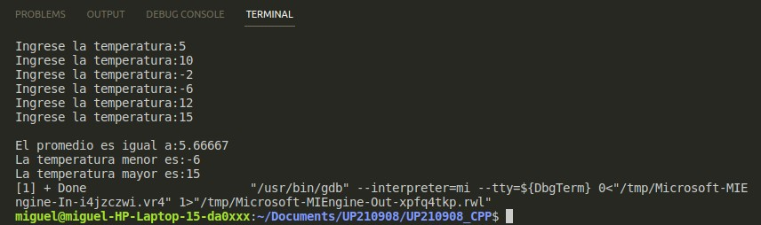
    </div>
</ol>
