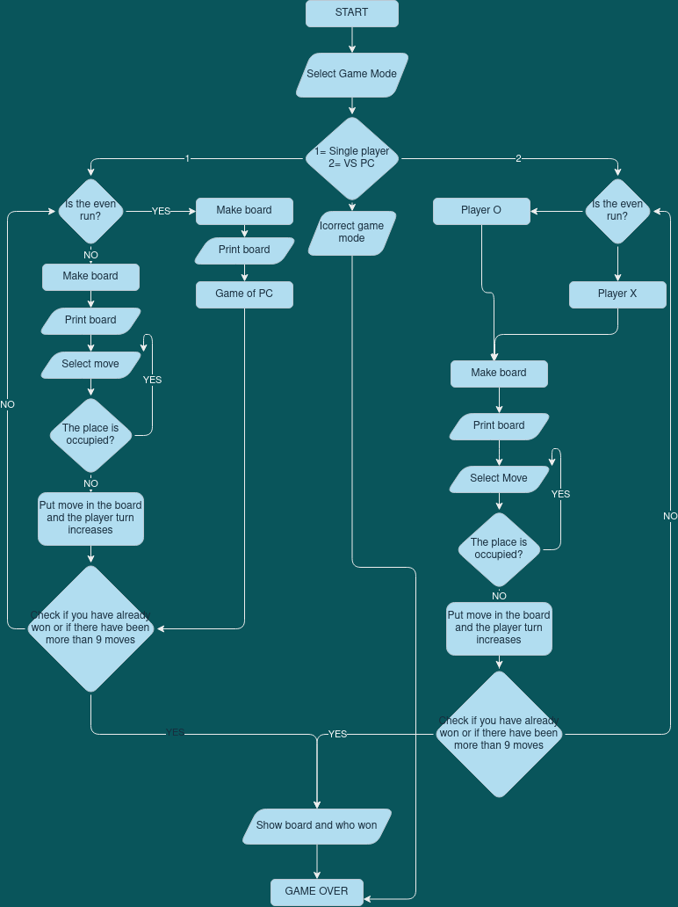
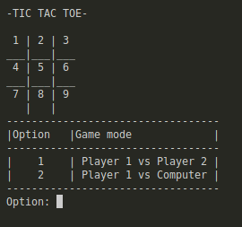
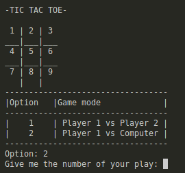
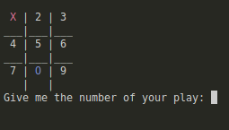
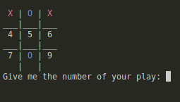
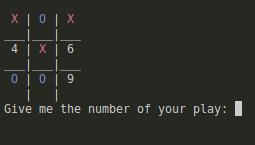
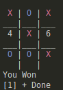

<h1> TIC TAC TOE GAME </h1>

 
 

 
<h2>INDEX:</h2> 

>### [Execution and considerations](#Execution instructions)  
>### [Flowchart](#Flowchart)  
>### [Game explanation](#Playtest)  
>### [Advantages and limitations](#Advantages)  

  

   

  <h2>Execution instructions</h2>
  Before you start playing, you must first make sure to perform the following steps for a correct execution of the game

<h2>For windows</h2>

1. Download or clone my repo with the following command in the terminal:
   
       "git clone https://github.com/UP210908/UP210908_CPP.git"

2. Download and install the compiler in this link https://sourceforge.net/projects/mingw/files/OldFiles/ 
3. Open the terminal at the direction of the file with the command:

       cd C:\Documents\...

4. To compile use command:

       gcc  05_JuegoGato.cpp -o 05_JuegoGato.exe

5. To run type this code:

       05_JuegoGato.exe

<h2> For Linux (Ubuntu)</h2>

1. Download or clone my repo with the following command in the terminal:
   
       "git clone https://github.com/UP210908/UP210908_CPP.git"

2. Install GNU c/c++ compiler, open the terminal and type:

       $ sudo apt-get update
       $ sudo apt-get install build-essential manpages-dev

3. To compile this program, type:

       gcc 05_JuegoGato.c -o 05_JuegoGato

4. To run this program, type:
   
       ./05_JuegoGato

 <h2>Flowchart</h2>

 
 <h2>Playtest</h2>

In the next section we can show how the game works, in this case the game mode <b>Player vs. Computer</b> is shown.

<ol>
<li> The first thing we can see on the screen is the menu, which will give us options to choose the game mode
     

     
     

<li>In this case we choose option two. Following this, we will obtain the second section that makes up the program, which asks us for the position number in which our move will be positioned.
     

     
 

 <li>The first move I make is to take position 1, the PC responds by taking position 8.
     

     
      

<li>The second move I make is to take position 3 with the aim of winning, the PC quickly intercepts position 2 to avoid it.
     

     
      

<li>Then I placed myself in position 5 leaving me with two chances to win and the PC with no other option placed in position 7.      
     

     
      

<li>I finally finish winning the game taking the ninth position
     

     
      
   
</ol>

<h2>Advantages</h2>

When making the program, the truth was a challenge, since it implied implementing a logic with functions, which is something that I have not trained much, in the end I was able to do it with the help of information sources and mainly trial and error for the operation of the program.
The program helped me a lot to grow and learn in this world of programming because I learned a lot of new functions and above all I developed a new logic.

